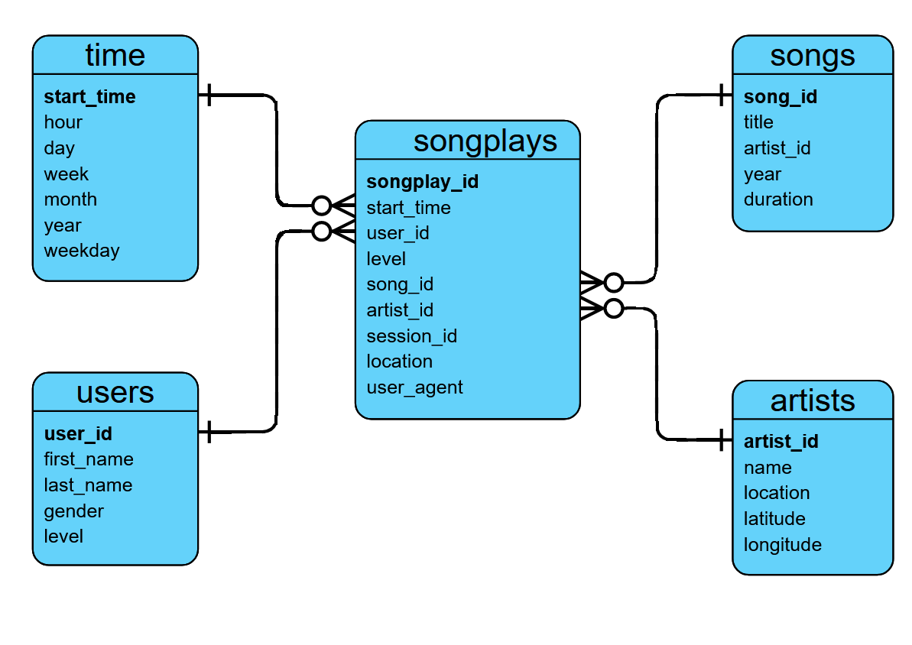

# Data-Modeling-with-PostreSQL
Analyze a song database of a fictional music streaming service. 

# Sparkify Analysis in Postgres

## Purpose

The music streaming service Sparkify is looking to identify which songs their users listen to. In order to query their data, a database schema and ETL pipeline must be designed to optimize the queries the analytics team uses. 
    
To start, the fact and dimension tables for this analysis will be defined using a star schema. An ETL pipeline will also be written in Python to pull raw data from JSON files and load that data into those tables in Postgres.

## How to Run

From the Terminal:
<ol>
    <li>python create_tables.py</li>
    <li>python etl.py</li>
</ol>

### Example JSON Files:

The included dataset has two sets of song data within the 'data' directory, 'log_data' and 'song_data':

#### Log Data Sample:
'''
{"artist":null,"auth":"Logged Out","firstName":null,"gender":null,"itemInSession":8,"lastName":null,"length":null,"level":"free","location":null,"method":"GET","page":"Home","registration":null,"sessionId":437,"song":null,"status":200,"ts":1541933298796,"userAgent":null,"userId":""}
'''

#### Song Data Sample:
'''
{"num_songs": 1, "artist_id": "ARXR32B1187FB57099", "artist_latitude": null, "artist_longitude": null, "artist_location": "", "artist_name": "Gob", "song_id": "SOFSOCN12A8C143F5D", "title": "Face the Ashes", "duration": 209.60608, "year": 2007}
'''

## Database Schema Design

A star schema is used to illustrate the relationships between the five tables. The fact table, *songplays*, contains identification facts for each song, and these ids are used to connect to the dimension tables *songs*, *artists*, *users* and *time*. The primary key in each of these dimension tables reference their corresponding foreign keys in the fact table.

By separating the JSON data into fact and dimension tables, the structure of the data is normalized, which increases the data integrity as there are less duplicate values, and therefore, less places to update the same data. This normalized structure also allows for adding new data in as few places as possible.

## ETL Pipeline

***\data***
The data directory contains two sub folders: \log_data and \song_data, which contain files in JSON format with metadata about the songs of interest.
**\song_data** contains information about the specific song and artist.
* The data from these JSON files are used to populate tables 'songs' and 'artists'.
**\log_data** contains the specific time users listened to each song.
* The data from these JSON files are used to populate tables 'time', 'users', and 'songplays'.

***sql_queries.py*** 
This file contains all the drop, create, and insert SQL queries.
This file is called from **create_tables.py**, **etl.ipynb**, and **etl.py**.

***create_tables.py***
This file establishes a connection to the Sparkify database and drops and recreates each table by calling the drop/create queries listed in the **sql_queries.py** file. 
This file is run before any other file and is used to refresh the tables.

***etl.ipynb***
This file is used as a step by step testing medium for ensuring data is loaded correctly into the SQL tables. 
It reads in a single JSON file from both \song_data and \log_data, then loads that data into the previously created SQL tables. 

***test.ipynb***
This file is used to confirm data was loaded correctly into the SQL tables.
After this file is run, the whole kernel needs to be restarted to close this file's connection to the database.

***etl.py***
After confirming all queries worked as expected from etl.ipynb, the same process established in that file is translated over to this file.
All JSON files are read using this .py file instead of just the first file in each folder. 
The test.ipynb file can be run again to confirm the etl.py file performed as expected.

## Citations
> christophersmith. (January 6, 2020). data-modeling-with-postgres. Github. https://github.com/christophersmith/data-modeling-with-postgres/tree/master
> Wathon. (December 12, 2020). Data-Modeling-with-Postgres. Github. https://github.com/Wathon/Data-Modeling-with-Postgres/tree/main
